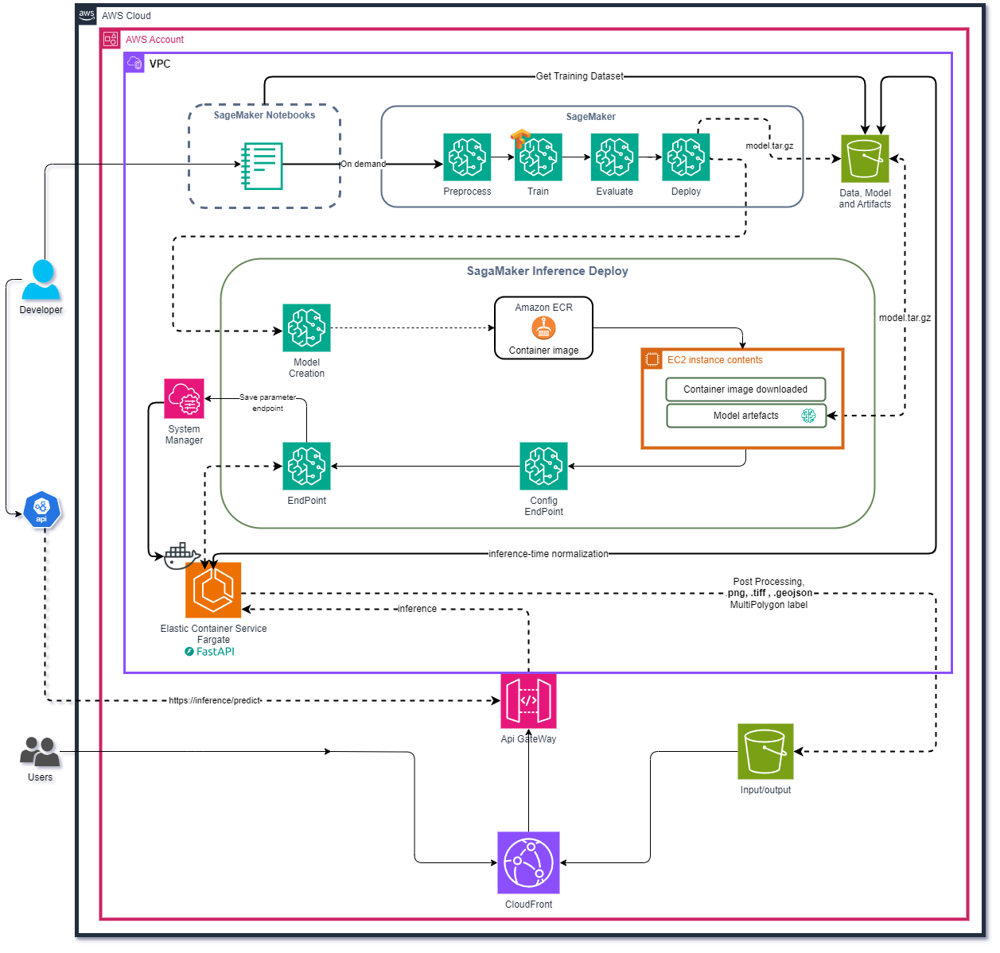

# fast_api_inference 

By: ECI.

Version: 0.1.0

This project is a FastAPI application that serves as an inference engine for a machine learning model. The application is designed to be deployed as a Docker container and can be run locally or on AWS.

[](https://sonarcloud.io/dashboard?id=julian36alvarez_fast-api-inference)


## Prerequisites

- [Anaconda](https://www.anaconda.com/download/) >=4.x
- Optional [Mamba](https://mamba.readthedocs.io/en/latest/)

## Create environment

```bash
conda env create -f environment.yml
activate fast_api_inference
```

or 

```bash
mamba env create -f environment.yml
activate fast_api_inference
```

## Project organization

    fast_api_inference
    ├── api
    │   ├── data                <- Data used by the API.
    │   ├── models              <- Model files and related artifacts.
    │   ├── normalization       <- Normalization data files.
    │   └── src                 <- Source code for the FastAPI application.
    │       └── main.py         <- Main entry point for the FastAPI application.
    │
    ├── config
    │   ├── constants.py        <- Configuration constants used throughout the project.
    │
    ├── data
    │   └── 3_output            <- Output data generated by the application.
    │       └── labels          <- Labels generated during processing.
    │
    ├── packages
    │   └── utils               <- Utility functions and helper scripts.
    │       └── get_path.py     <- Script to get paths for various resources.
    │
    ├── .gitignore              <- Files and directories to be ignored by git.
    │
    ├── Dockerfile              <- Dockerfile for building the Docker image.
    │
    ├── environment.yml         <- Conda environment configuration file.
    │
    ├── README.md               <- The top-level README for developers using this project.
    │
    └── requirements.txt        <- Python dependencies required for the project.

## Architecture Diagram of FastAPI Components


## AWS Architecture Diagram

